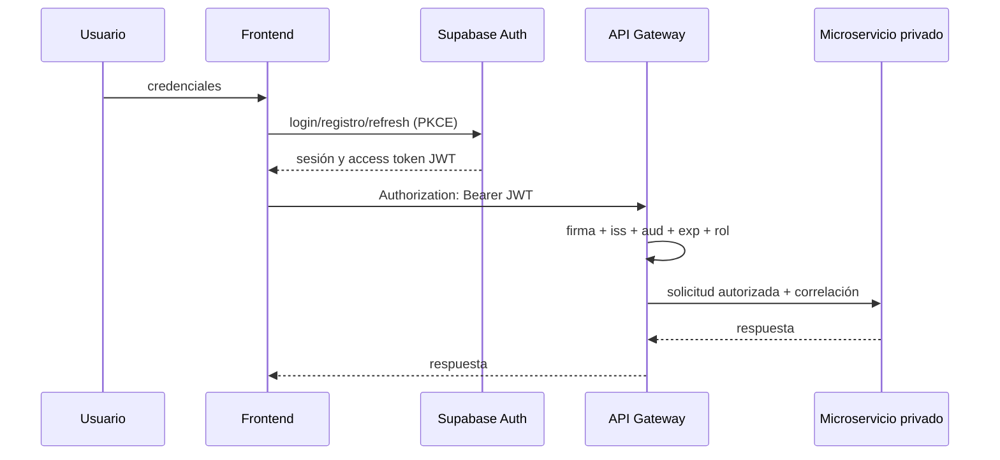

# Decisión de autenticación y autorización

Fecha: 2026-09-23. Estado: decisión de arquitectura para el MVP; la implementación requiere configurar el proyecto Supabase y sus valores por ambiente.

## Decisión

Green AI utilizará **Supabase Auth como proveedor de identidad** y sus access tokens JWT. No se crearán contraseñas, hashes ni JWT propios en Frontend, Gateway o la tabla `public.usuario`.

La comunicación queda así:



La regla “Frontend sin acceso directo a Supabase” se precisa así: el navegador puede usar **únicamente Supabase Auth** para sesión. No puede llamar Supabase Data API, tablas, Storage, Prometheus ni microservicios internos. Si más adelante se adopta un Backend for Frontend con cookies, este flujo podrá cambiar sin modificar los contratos funcionales.

## Responsabilidad por componente

| Componente | Responsabilidad |
| --- | --- |
| Supabase Auth | Registrar e identificar usuarios, custodiar contraseñas, renovar sesiones y firmar JWT |
| Frontend | Usar el SDK oficial, flujo PKCE, adjuntar el access token y reaccionar a 401/403; ocultar controles solo como ayuda visual |
| Gateway | Ser OAuth2 Resource Server, validar JWT y aplicar autorización por ruta; nunca recibir ni almacenar contraseñas |
| Microservicios | Permanecer en red privada y confiar en la decisión de entrada del Gateway para solicitudes de usuario; validar permisos de dominio propios cuando corresponda |
| Base de datos | Guardar perfiles y permisos, sin contraseñas; aplicar RLS mínima a cualquier acceso autorizado |

Gateway debe validar criptográficamente la firma mediante el JWKS de Supabase y comprobar como mínimo `iss`, `aud=authenticated` y `exp`. Se usarán claves asimétricas y descubrimiento JWKS; el JWT secret o `service_role` nunca llegan al navegador ni se comparten entre repositorios.

## Roles del MVP

- `OPERATOR`: consulta catálogo, métricas actuales, históricos y predicciones autorizadas.
- `ADMIN`: incluye lo anterior y futuras operaciones administrativas explícitas.

El claim de aplicación será `user_role`, generado mediante un Custom Access Token Hook a partir de una tabla de roles administrada por servidor. El claim estándar `role=authenticated` de Supabase no sustituye al rol de aplicación. El formulario de registro no acepta un rol: todo usuario nuevo comienza como `OPERATOR`; solo un administrador puede elevarlo.

Gateway es la autoridad de autorización HTTP. El Frontend puede leer `user_role` para presentar la interfaz, pero nunca basta con ocultar un botón. Un token válido sin el rol requerido recibe 403; un token ausente, inválido o vencido recibe 401.

## Sesión del Frontend

- Sustituir `usuarioLogueado` por la sesión administrada por el SDK de Supabase Auth.
- No guardar manualmente contraseñas, perfiles completos ni un JWT construido por la aplicación.
- Usar access tokens de corta duración y renovación con refresh token gestionada por el SDK.
- Enviar `Authorization: Bearer <access-token>` a Gateway.
- Al recibir 401, intentar una renovación controlada una sola vez; si falla, cerrar la sesión. Un 403 no se resuelve renovando.
- Restringir CORS al origen exacto del Frontend y evitar scripts CDN sin control de integridad o una política CSP adecuada.

## Migración de `public.usuario`

La tabla actual no debe seguir siendo fuente de credenciales. La migración debe:

1. crear una relación única `auth_user_id uuid` hacia `auth.users(id)` o reemplazar la tabla por un perfil equivalente;
2. conservar únicamente datos de perfil necesarios, como nombre y fecha de creación;
3. eliminar `password` y `password_hash` después de migrar cuentas de manera segura; no copiar hashes incompatibles a Supabase Auth;
4. normalizar roles a `ADMIN` y `OPERATOR` en una tabla controlada por servidor;
5. reemplazar las políticas `USING (true)` dirigidas a `public` por políticas mínimas para `authenticated` y operaciones administrativas;
6. impedir que el cliente modifique su propio rol.

Como ambas columnas de contraseña son actualmente `NOT NULL`, la eliminación debe realizarse mediante una migración versionada y comprobada; no deben rellenarse con valores ficticios.

## Superficie y despliegue

Públicos sin JWT: health/liveness, recursos estáticos y, si el equipo lo decide, el catálogo OpenAPI. Las rutas `/api/monitoring/**`, `/api/processing/**`, `/api/prediction/**` y `/api/simulator/**` requieren al menos `OPERATOR`, salvo una excepción documentada.

Configuración esperada en Gateway:

```text
GATEWAY_AUTH_ISSUER_URI=https://<project-ref>.supabase.co/auth/v1
GATEWAY_AUTH_JWK_SET_URI=https://<project-ref>.supabase.co/auth/v1/.well-known/jwks.json
GATEWAY_AUTH_AUDIENCE=authenticated
```

No se incluyen valores reales en Git. La activación requiere disponer de URL del proyecto, claves asimétricas/JWKS, redirect URLs del Frontend, CORS y el hook de `user_role`. Hasta entonces Login y Registro deben figurar como demo y el Gateway no debe aceptar el objeto local como identidad.

## Criterios de aceptación

- una petición sin token a una ruta protegida devuelve 401;
- token alterado, vencido, con issuer o audience incorrectos devuelve 401;
- `OPERATOR` puede leer métricas y no puede ejecutar una ruta de `ADMIN`;
- modificar el rol en HTML, `localStorage` o el cuerpo de registro no cambia permisos;
- el Gateway no registra tokens ni devuelve secretos en errores;
- cerrar sesión impide renovar la sesión y el access token deja de aceptarse al vencer;
- ninguna tabla pública contiene contraseña o hash de aplicación.

## Referencias técnicas

- [Supabase Auth](https://supabase.com/docs/guides/auth)
- [Sesiones y renovación de tokens](https://supabase.com/docs/guides/auth/sessions)
- [JWT y endpoint JWKS](https://supabase.com/docs/guides/auth/jwts)
- [Custom claims y RBAC](https://supabase.com/docs/guides/api/custom-claims-and-role-based-access-control-rbac)
