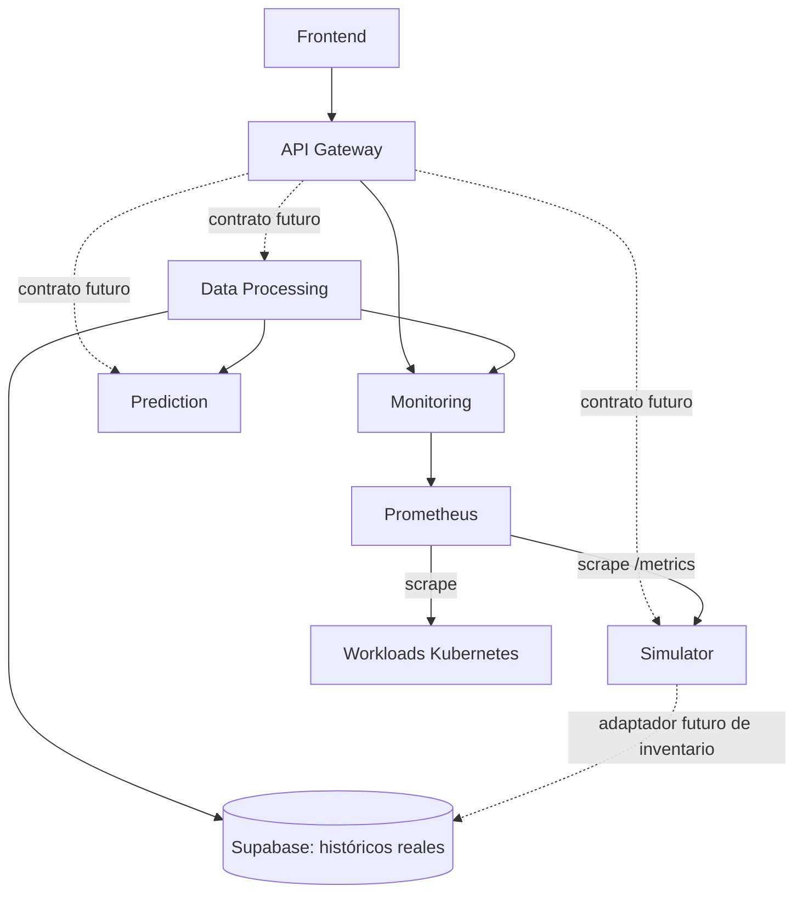

# Guía de ensamblaje de microservicios Green AI

Fecha: 2026-09-21. Este documento fija los límites de integración del MVP para evitar contratos incompatibles entre repositorios.

## Flujo vigente

El flujo integrado y comprobado actualmente es `Simulator → Prometheus → Monitoring`. La flecha expresa movimiento lógico de datos; técnicamente Prometheus inicia el scrape al Simulator y Monitoring inicia la consulta a Prometheus.

## Propiedad de datos y contratos

| Componente | Recibe de | Entrega a | No debe hacer |
| --- | --- | --- | --- |
| Simulator | Fixture; inventario Supabase en un adaptador futuro | Prometheus `/metrics` | Escribir logs reales o presentar simulación como observación |
| Prometheus | Scrape de exporters/workloads | Monitoring mediante API PromQL | Ser consultado directamente por Frontend o Data Processing |
| Monitoring | Prometheus | Gateway y Data Processing | ETL, SQL/Supabase, predicción o texto de presentación |
| Data Processing | Monitoring y Supabase | Gateway y Prediction | Exponer DataFrames como contrato o entrar por Gateway para pipelines internos |
| Gateway | Frontend | Servicios internos registrados | PromQL, SQL, ETL, acceso a Supabase o proxy comodín |
| Frontend | Gateway | Usuario | Acceso directo a microservicios, Prometheus o Supabase |

## Direcciones HTTP

Las direcciones son configurables. Los nombres siguientes son convenciones para Docker Compose y deberán reemplazarse por Services DNS reales en Kubernetes.

| Origen | Destino | Base URL interna |
| --- | --- | --- |
| Gateway | Monitoring | `http://monitoring:8080` |
| Data Processing | Monitoring | `http://monitoring:8080` |
| Monitoring | Prometheus | `http://prometheus:9090` |
| Prometheus | Simulator | `http://simulator:8000/metrics` |
| Frontend | Gateway | `http://gateway:8081` en desarrollo |

Nunca usar `localhost` para alcanzar otro contenedor o pod.

## Contratos confirmados

### Simulator → Prometheus

Exporter Node Exporter compatible con `cluster`, `node` y `origin=simulated`. Métricas: CPU, memoria, red y filesystem. Cada run usa un cluster diferente.

### Monitoring interno

- `GET /api/v1/metrics/catalog`
- `GET /api/v1/metrics/current`
- `GET /api/v1/metrics/history`

El OpenAPI autoritativo está en el repositorio Monitoring. Solo admite las métricas del catálogo, `resourceType=node`, filtros exactos y rangos históricos de hasta 24 horas. Entrega JSON con `origin`, `quality` y `dataStatus`.

### Gateway externo

- `GET /api/monitoring/v1/metrics/catalog`
- `GET /api/monitoring/v1/metrics/current`
- `GET /api/monitoring/v1/metrics/history`

El Gateway conserva parámetros y respuestas y reescribe el prefijo. Otras rutas no están publicadas.

## Reglas para Data Processing

1. Consultar Monitoring directamente mediante su URL interna.
2. Convertir JSON a DataFrame solo dentro de Data Processing.
3. Preservar unidad, timestamp, recurso, labels, origin y quality en cada transformación trazable.
4. No convertir `missing`, `non_finite` o `no_data` en cero.
5. No mezclar `observed`, `simulated` y `estimated` sin una operación explícita y documentada.
6. No sumar interfaces o filesystems implícitamente; la agregación debe declarar su significado.
7. Dividir rangos mayores de 24 horas y resolver la frontera inclusiva sin duplicar una muestra idéntica.
8. Tratar 400/422 como solicitudes inválidas y 502/503/504 como fallos de fuente/transporte, no como datasets vacíos.
9. Publicar un OpenAPI propio antes de añadir rutas al Gateway.

## Contratos todavía pendientes

- API de Data Processing: resúmenes, historias procesadas, jobs, errores y límites.
- API de Prediction y formato de features.
- Operaciones externas del Simulator, si realmente son necesarias.
- DDL y permisos mínimos de Supabase por servicio.
- JWT, emisor, audiencia y roles del Gateway.
- Métricas de workloads Grupo B y fuentes definitivas.
- Despliegue y nombres DNS de Kubernetes.

Ningún equipo debe completar estos vacíos con rutas, tablas o unidades inventadas. Debe proponer el contrato, revisarlo con sus consumidores y versionarlo en el repositorio propietario.

## Regla de publicación

Cada microservicio vive en un repositorio Git independiente. Su README explica ejecución y consumo; su OpenAPI es la fuente de verdad del contrato; sus variables de entorno no contienen credenciales reales. Los documentos generales explican relaciones, pero no reemplazan los contratos versionados de cada servicio.
