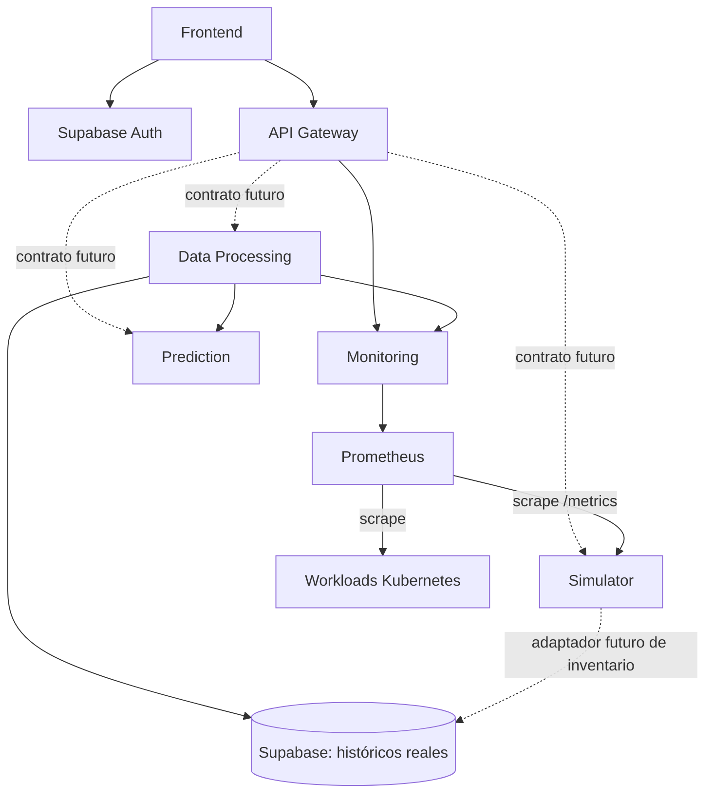

# Guía de ensamblaje de microservicios Green AI

Fecha: 2026-09-21. Este documento fija los límites de integración del MVP para evitar contratos incompatibles entre repositorios.

## Flujo vigente



El flujo integrado y comprobado actualmente es `Simulator → Prometheus → Monitoring`. La flecha expresa movimiento lógico de datos; técnicamente Prometheus inicia el scrape al Simulator y Monitoring inicia la consulta a Prometheus.

## Propiedad de datos y contratos

| Componente | Recibe de | Entrega a | No debe hacer |
| --- | --- | --- | --- |
| Simulator | Fixture; inventario Supabase en un adaptador futuro | Prometheus `/metrics` | Escribir logs reales o presentar simulación como observación |
| Prometheus | Scrape de exporters/workloads | Monitoring mediante API PromQL | Ser consultado directamente por Frontend o Data Processing |
| Monitoring | Prometheus | Gateway y Data Processing | ETL, SQL/Supabase, predicción o texto de presentación |
| Data Processing | Monitoring y Supabase | Gateway y Prediction | Exponer DataFrames como contrato o entrar por Gateway para pipelines internos |
| Gateway | Frontend | Servicios internos registrados | PromQL, SQL, ETL, acceso a Supabase o proxy comodín |
| Frontend | Gateway | Usuario | Acceso directo a microservicios, Prometheus o Supabase |

## Direcciones HTTP

Las direcciones son configurables. Los nombres siguientes son convenciones para Docker Compose y deberán reemplazarse por Services DNS reales en Kubernetes.

| Origen | Destino | Base URL interna |
| --- | --- | --- |
| Gateway | Monitoring | `http://monitoring:8080` |
| Data Processing | Monitoring | `http://monitoring:8080` |
| Monitoring | Prometheus | `http://prometheus:9090` |
| Prometheus | Simulator | `http://simulator:8000/metrics` |
| Frontend | Gateway | `http://gateway:8081` en desarrollo |

Nunca usar `localhost` para alcanzar otro contenedor o pod.

## Contratos confirmados

### Simulator → Prometheus

Exporter Node Exporter compatible con `cluster`, `node` y `origin=simulated`. Métricas: CPU, memoria, red y filesystem. Cada run usa un cluster diferente.

### Monitoring interno

- `GET /api/v1/metrics/catalog`
- `GET /api/v1/metrics/current`
- `GET /api/v1/metrics/history`

El OpenAPI autoritativo está en el repositorio Monitoring. Solo admite las métricas del catálogo, `resourceType=node`, filtros exactos y rangos históricos de hasta 24 horas. Entrega JSON con `origin`, `quality` y `dataStatus`.

### Gateway externo

- `GET /api/monitoring/v1/metrics/catalog`
- `GET /api/monitoring/v1/metrics/current`
- `GET /api/monitoring/v1/metrics/history`

El Gateway conserva parámetros y respuestas y reescribe el prefijo. Otras rutas no están publicadas.

## Reglas para Data Processing

1. Consultar Monitoring directamente mediante su URL interna.
2. Convertir JSON a DataFrame solo dentro de Data Processing.
3. Preservar unidad, timestamp, recurso, labels, origin y quality en cada transformación trazable.
4. No convertir `missing`, `non_finite` o `no_data` en cero.
5. No mezclar `observed`, `simulated` y `estimated` sin una operación explícita y documentada.
6. No sumar interfaces o filesystems implícitamente; la agregación debe declarar su significado.
7. Dividir rangos mayores de 24 horas y resolver la frontera inclusiva sin duplicar una muestra idéntica.
8. Tratar 400/422 como solicitudes inválidas y 502/503/504 como fallos de fuente/transporte, no como datasets vacíos.
9. Publicar un OpenAPI propio antes de añadir rutas al Gateway.

## Contratos todavía pendientes

- API de Data Processing: resúmenes, historias procesadas, jobs, errores y límites.
- API de Prediction y formato de features.
- Operaciones externas del Simulator, si realmente son necesarias.
- Esquema verificado en modelo-bd.md; pendiente configurar permisos mínimos de Supabase por servicio.
- Implementación de la decisión JWT/Supabase Auth y migración segura de usuarios descrita en `AUTENTICACION-JWT.md`.
- Métricas de workloads Grupo B y fuentes definitivas.
- Despliegue y nombres DNS de Kubernetes.

Ningún equipo debe completar estos vacíos con rutas, tablas o unidades inventadas. Debe proponer el contrato, revisarlo con sus consumidores y versionarlo en el repositorio propietario.

## Contrato de comunicación por componente

Esta sección define la información intercambiada y su significado. Cada equipo conserva libertad sobre su arquitectura interna, bibliotecas y algoritmos.

### Frontend

Consume exclusivamente rutas públicas del Gateway. Debe mostrar:

- recurso: clúster, tipo y nodo;
- periodo consultado y zona horaria visible;
- valor y unidad;
- procedencia: observado, simulado, estimado o desconocido;
- calidad: completo, parcial o sin datos;
- advertencias y estado de operaciones largas;
- predicciones diferenciadas visualmente de mediciones históricas.

Reglas de presentación: ratios como porcentaje; bytes y bytes/s en una escala legible sin perder la unidad original; `null` como “sin dato”, nunca como cero; interfaces y filesystems separados salvo que Data Processing entregue una agregación explícita. El Frontend traduce etiquetas y mensajes para humanos, pero no recalcula métricas.

#### Alineación del prototipo `GreenAi_TPI`

Se revisó el [prototipo experimental del Frontend](https://github.com/LeonidKisley/GreenAi_TPI) en el commit `c673bac` (2026-09-22). Su navegación, tema claro/oscuro, estructura del dashboard, vista de red y gráficos sirven como base visual. Los valores y flujos actuales son demostrativos y no constituyen contratos del sistema.

Para integrarlo al MVP:

1. Centralizar las llamadas en un adaptador HTTP del Frontend cuya única base URL sea el Gateway. Sustituir el consumo actual de `/api/kpis`, `/api/logs`, `/api/hardware` y `/api/usuarios` por las rutas públicas confirmadas o por futuros OpenAPI aprobados. `localhost` solo puede existir como configuración de desarrollo.
2. Construir el selector de métricas desde `GET /api/monitoring/v1/metrics/catalog` y obtener valores e históricos desde `current` y `history`. La interfaz no debe consultar Supabase, Prometheus, Monitoring, Simulator ni Prediction directamente.
3. Mostrar junto a cada resultado el recurso, periodo, unidad, `origin`, `quality`, `dataStatus` y advertencias. Debe haber estados distintos para carga, respuesta vacía, datos parciales y error; los errores `application/problem+json` deben conservar su `X-Request-Id` para soporte.
4. Convertir unidades solo para presentación: ratios de CPU a porcentaje; bytes a MiB/GiB; bytes/s a KiB/s o MiB/s. Mantener disponible el valor y unidad originales. Watts representan potencia instantánea, no energía: el gráfico mensual en kWh y afirmaciones de energía “real”, ahorro o CO₂ deben ocultarse o marcarse explícitamente como demo hasta que exista una fuente y contrato validados.
5. Tratar `null` como “Sin dato” y `no_data` como estado vacío; nunca reemplazarlos por cero. Distinguir visualmente `observed`, `simulated` y `estimated`, y no presentar una predicción como medición.
6. Usar Supabase Auth y JWT según `AUTENTICACION-JWT.md`. La identidad guardada en `localStorage` no es autenticación y el rol nunca se acepta desde el formulario. Gateway valida el token y aplica permisos; el Frontend solo usa el rol para presentación.

Antes de reutilizar el repositorio se requiere saneamiento:

- revocar y rotar inmediatamente las credenciales de base de datos que fueron versionadas; eliminar también `.env` y esos secretos del historial Git;
- retirar `node_modules`, binarios como `kubectl.exe` y artefactos generados; conservar un lockfile y añadir reglas `.gitignore`;
- separar o archivar el Backend Express, el exporter y los manifiestos Kubernetes experimentales para que no se desplieguen junto a los servicios oficiales;
- eliminar el manejo de contraseñas en texto plano y el hash simulado. La API actual de usuarios tampoco debe devolver filas completas;
- fijar versiones de imágenes de contenedor en vez de usar `latest`.

El equipo del Frontend puede decidir framework y estructura interna. Para el ensamblaje solo son obligatorios el acceso exclusivo por Gateway, los contratos publicados y la semántica de datos definida aquí.

### API Gateway

Recibe solicitudes del Frontend y entrega la respuesta del servicio propietario. Añade o propaga `X-Request-Id`, aplica rutas permitidas, CORS, autenticación, límites y timeouts. No transforma métricas ni fusiona respuestas.

Para solicitudes de usuario, Gateway será OAuth2 Resource Server: verificará los JWT emitidos por Supabase Auth mediante JWKS, issuer, audience y expiración, y aplicará los roles `OPERATOR` y `ADMIN`. Gateway no emite tokens ni procesa contraseñas.

Rutas confirmadas:

```text
/api/monitoring/v1/metrics/* → Monitoring /api/v1/metrics/*
```

Las rutas de Data Processing, Prediction y Simulator se agregan solo después de que esos equipos publiquen su OpenAPI. Cada ruta externa conservará un prefijo que identifique al propietario: `/api/processing/v1`, `/api/prediction/v1` o `/api/simulator/v1`.

### Simulator

Produce estado sintético por nodo y lo expone a Prometheus en `/metrics`. Cada serie incluye identidad estable de nodo, clúster único del run y `origin=simulated`. Publica CPU, memoria, red y filesystem con tipos/unidades compatibles con el contrato acordado.

No entrega JSON analítico al Frontend ni escribe sus resultados en los logs reales de Supabase. Un futuro control de runs deberá declarar como mínimo escenario, seed, duración, estado y run ID en un OpenAPI propio antes de conectarse al Gateway.

### Prometheus

Recolecta series del Simulator y de exporters/workloads. Conserva el historial temporal y responde PromQL únicamente a Monitoring. No es una API pública y ningún equipo debe construir URLs PromQL desde datos enviados por el usuario.

### Monitoring

Entrega JSON técnico normalizado mediante catálogo, consulta actual e historial. Cada respuesta contiene:

- identificador de métrica y unidad;
- agregación y ventana;
- periodo y resolución;
- recurso y labels de la serie;
- `source` y `origin`;
- muestras `{timestamp, value, quality}`;
- `dataStatus` y advertencias.

Monitoring no devuelve DataFrames, conclusiones, tendencias o textos para usuarios. Gateway conserva esta respuesta para el Frontend y Data Processing la consulta directamente para análisis.

### Data Processing

Guía paso a paso para completar la rama `feature/data-processing-integration` sin depender del avance de Prediction: [integración de Data Processing](GUIA-INTEGRACION-DATA-PROCESSING.md). Distingue el código revisado de los endpoints propuestos y detalla Monitoring, Supabase, errores, pruebas y entrega al Gateway.

Recibe dos clases de entrada:

1. series normalizadas de Monitoring, incluidas las simuladas almacenadas en Prometheus;
2. históricos reales autorizados de Supabase.

Debe conservar identidad, unidad, periodo, resolución, procedencia y calidad. Define y documenta sus propias reglas de limpieza, alineación, imputación y agregación. Su salida hacia otros servicios será JSON y debe declarar al menos:

```json
{
  "schemaVersion": "1.0",
  "datasetId": "identificador-trazable",
  "period": {"start": "RFC3339", "end": "RFC3339"},
  "resource": {"type": "node", "cluster": "...", "id": "..."},
  "features": [{"name": "...", "value": 0.0, "unit": "..."}],
  "origins": ["observed"],
  "dataStatus": "complete|partial|no_data",
  "warnings": []
}
```

Los nombres de features, ventanas y reglas estadísticas pertenecen a Data Processing y deben acordarse con Prediction. Un DataFrame puede utilizarse internamente, pero no es el formato de comunicación entre servicios.

### Prediction

Recibe datasets/features versionados de Data Processing. No consulta Prometheus ni Supabase directamente y no recibe series sin preparar desde el Frontend. Su respuesta debe permitir interpretar y auditar la predicción:

```json
{
  "predictionId": "...",
  "resource": {"type": "node", "cluster": "...", "id": "..."},
  "target": "nombre-de-variable",
  "predictedFor": "RFC3339",
  "value": 0.0,
  "unit": "...",
  "modelVersion": "...",
  "inputDatasetId": "...",
  "origin": "estimated",
  "generatedAt": "RFC3339"
}
```

Intervalos de confianza, horizonte y métricas del modelo se añaden cuando el equipo defina su semántica. Una predicción siempre es `estimated`; nunca se presenta como medición observada.

#### Estado del avance ML revisado — 2026-09-23

La rama [`Criss`](https://github.com/woshtsu/green-ai-project-docs/tree/Criss), revisada en el commit `75f0b8602c0ea326c282cf2d1cf06c7955898cbf`, implementa un núcleo ML experimental: validación y limpieza, features temporales, horizontes 5/15/30 minutos, baselines, Random Forest, XGBoost, evaluación, serialización, MLflow local, inferencia fuera de línea y pruebas. Sus resultados publicados provienen de un fixture simulado y no acreditan precisión con datos reales ni ahorro energético.

Antes de considerar validado el modelo deben corregirse tres bloqueos: separar selección y prueba final (el pipeline actual selecciona con TEST), purgar las fronteras temporales según el horizonte y sustituir dos aserciones anti-leakage terminadas en `or True` por verificaciones temporales que puedan fallar. También debe unificarse el contrato de entrada: el código espera registros temporales, mientras el ejemplo de Data Processing de este documento usa objetos `name/value/unit`.

El avance todavía no es el Prediction Service. Faltan la API/OpenAPI, el contrato completo de respuesta, el preprocesamiento compartido entre entrenamiento e inferencia, salud, contenedor, límites operativos y prueba Data Processing → Prediction. La revisión, evidencia y criterios de cierre están en [Revisión del avance de Prediction — rama Criss](revision-prediction-criss.md).

### Supabase

Mantiene datos reales bajo propiedad explícita:

- Simulator podrá leer inventario `hardware` con permisos mínimos cuando se implemente el adaptador y se configuren sus permisos;
- Data Processing podrá leer históricos `logs`;
- Gateway, Monitoring, Prometheus y Frontend no poseen credenciales de Supabase;
- ningún servicio accede a `usuario` como efecto secundario de compartir la instancia.

Los servicios intercambian identificadores, no credenciales ni filas completas innecesarias. Los resultados simulados no se insertan en la tabla de logs reales.

### Workloads Kubernetes

Exponen métricas técnicas mediante exporters/instrumentación para que Prometheus las recolecte. No llaman a Monitoring. Estado de pods/réplicas y métricas HTTP de aplicación pertenecen al Grupo B y requieren catálogo, etiquetas y unidades acordados antes de mostrarse en Frontend.

## Reglas comunes para todos los contratos

- JSON para APIs REST; Prometheus exposition format únicamente entre exporters y Prometheus.
- RFC 3339 con zona para timestamps; UTC en contratos internos.
- Unidades explícitas y estables. No inferir energía desde CPU ni confundir watts con kWh.
- `observed`, `simulated`, `estimated` y `unknown` conservan significados distintos.
- Ausencia, cero y error son estados diferentes.
- Cada servicio versiona su OpenAPI y es propietario de sus rutas internas.
- Los errores deben tener código, estado, detalle seguro y request ID, sin SQL, PromQL, trazas, DNS internos o secretos.
- Los cambios incompatibles crean una nueva versión del contrato; no se corrigen alterando silenciosamente otro servicio.

## Regla de publicación

Cada microservicio vive en un repositorio Git independiente. Su README explica ejecución y consumo; su OpenAPI es la fuente de verdad del contrato; sus variables de entorno no contienen credenciales reales. Los documentos generales explican relaciones, pero no reemplazan los contratos versionados de cada servicio.

## Referencia de BD actualizada — 2026-09-22

Consultar el [modelo de BD](modelo-bd.md): diagrama y campos completos de `usuario`, `hardware` y `logs`, con mapeos y limitaciones de integración. El diagrama aporta tipos y relaciones; la extracción SQL del usuario confirma tipos y nulabilidad. La extracción completa confirma defaults, longitudes/precisión, restricciones, índices y RLS; verificación documental del esquema cerrada. Monitoring conserva Prometheus como fuente y Simulator conserva JSON/JSONL como persistencia; el acceso a inventario SQL es futuro. Esta referencia actualiza las suposiciones del esquema, sin ampliar el catálogo de métricas ni implementar acceso a BD.
